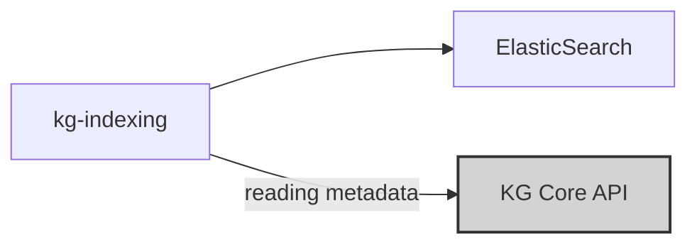
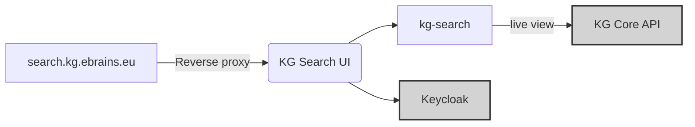

# Components and dependencies

The KG Search is split into a user interface as well as two different ways of how to get the underlying metadata according to the use-case:

## Index-based search

The default is the index based search. Here, the kg-indexing service reads the metadata from the KG Core API, translates it and indices it in a ElasticSearch index. This can be done for different levels such as "released" and "in progress".

The kg-indexing service provides an API to trigger different levels of the indexing mechanism. For EBRAINS, these endpoints are triggered by a scheduled automation job.

As soon as the index is available, the user-interface can request the precomputed, denormalized metadata from the ElasticSearch instance and apply access restrictions based on user account roles (e.g. to restrict the "in progress" indices to curators only).

### Scalabilty
Please note that the "index-based search" can easily be scaled horizontally either by replication of the indices or clustering of the ElasticSearch database.

## Live search
To allow review mechanism and to simplify development, the KG Search also knows a "live mode". When querying instances on the KG Search in live mode, the underlying data structures
are not consumed from the ElasticSearch instance but rather directly from the KG Core API which makes it "live" (no delay). It also profits from the permission management of the KG Core
since the requesting user will only be able to access those resources which are available from the specific account. 

Due to the fact that some representations in KG Search are rather complex and transitioning many levels of the graph, this mode can suffer from some performance penalties compared to the "index-based search".

