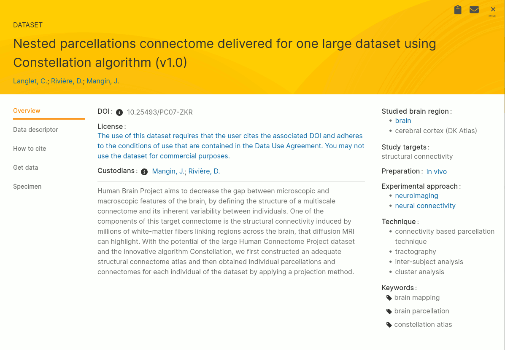
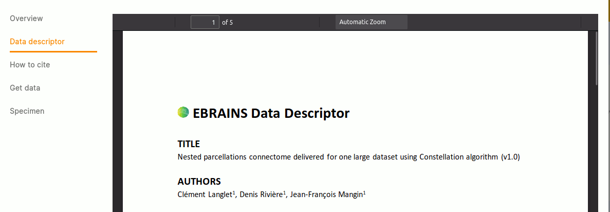
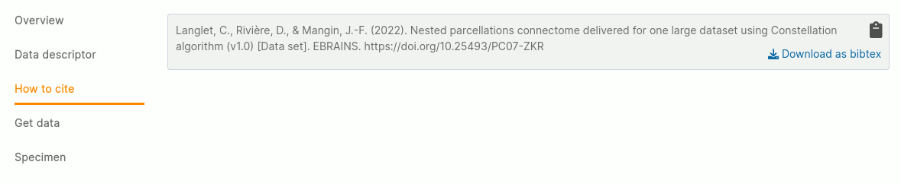
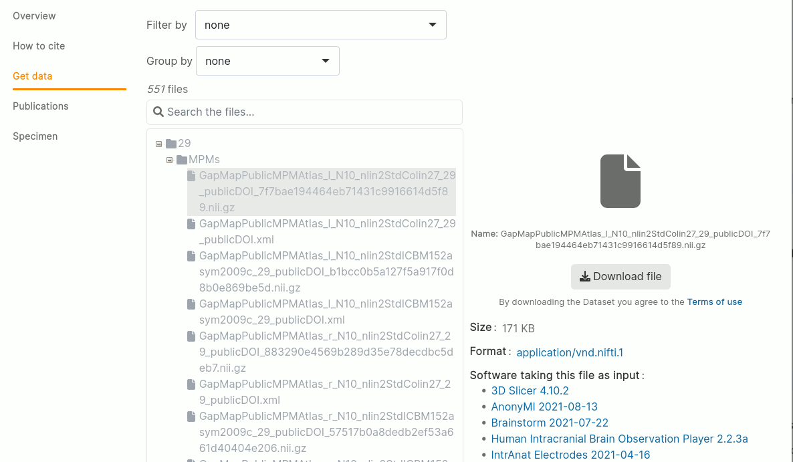
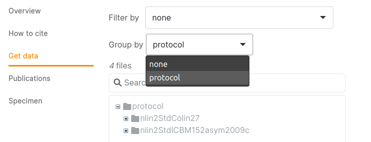
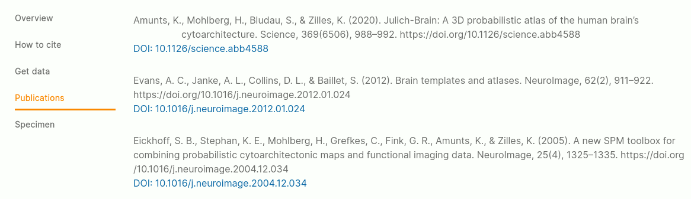
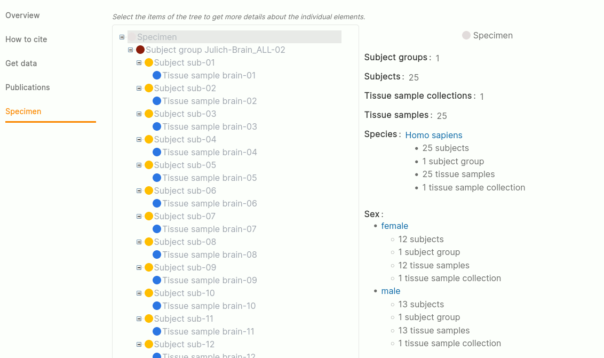

# Datasets

## Overview

*Overview section of a dataset*   

The overview section of the dataset shows the information you need to get a first idea about what the dataset is about.
It's usually presented with a main section, containing information such as DOI, license, custodian and description. 
On the left side, you find some more keyword-alike information allowing you to get a short overview about the regions, 
approaches, techniques, etc. that have been used.

## Data descriptor

*An example for a data descriptor of a dataset*   

The data descriptor is a more detailed information source describing the context of the dataset. This often is a PDF but 
can also be a link to an external resource or a publication.

## How to cite

*An example for citation instructions of a dataset*   

This section provides you with citation information. Options such as "Bibtex" downloads can be applied for those datasets 
which are citable via a DOI.

## Get data

*Get data section of a dataset*   

The "Get data" section is meant for giving direct access to the files of the dataset. Please note, that this section might look
different for those datasets that are under embargo, protected with additional permission management checks (the Human Data Gateway)
or if the data is hosted externally from EBRAINS. 

The file view allows you to navigate through the files, download (sub-)directories as ZIP files, to search for files by their name and to show details 
such as their formats and links to related resources (e.g. software compatible with those files, links to viewers, etc.).

### Filtering

*Filtering the files by "Content type"*   

If registered in the metadata, the Search UI provides a filter mechanism to select only those files which are of a specific "content type".

### Grouping

*Group the files by an aspect*   

If registered in the metadata, the Search UI provides the possibility to regroup the files according to a specific aspect
(e.g. by subject, by technique, by protocol, ...). This allows to provide different views on the data in addition to the purely
hierarchical view as specified by the data provider.

## Publications

*Showing publications belonging to a dataset* 

The publications section lists related publications to the given dataset.

## Specimen

*Explore the specimen related to this dataset*

In the "Specimen" section, subjects as well as tissue samples (and or their groups / collections) are visualized in relation to each other.
In the left area of the tree, you can find some details - by default it's an aggeregated view showing the distribution of several attributes across all specimen involved. 
Once a specific specimen is selected, the left panel shows the details about this specific entity.