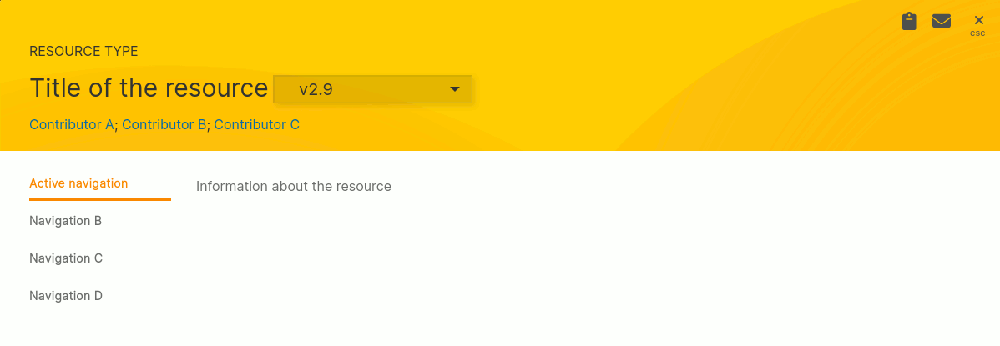

# Browse results (general)
Once an interesting result is found, the detail view can be opened to explore the various detail sections.   

*Generic example of a result card*

## Title section
The title section shows the title and the possibility to navigate between different versions of the instance if available.   
It also contains the list of contributors. Please note, that you can navigate to the detail cards of those contributors
to explore other research products (datasets, models, software, ...) they were involved in.

### Other UI elements
- **Resource type**: Showing the type of the resource - e.g. "Dataset", "Model", ...
- **Copy to clipboard / Share by e-mail**: The two icons on the right top allow you to copy / to share a link by e-mail which points to this resource.

## Navigation section
Allowing you to navigate between different aspects of this resource. The currently active navigation element is visually highlighted.

## Main section
The main section contains the information about the aspect you were selecting in the navigation.
