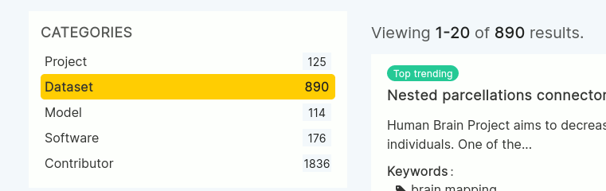
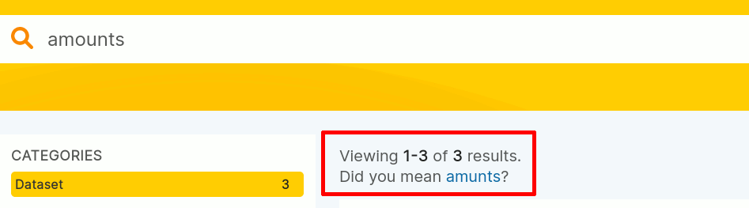
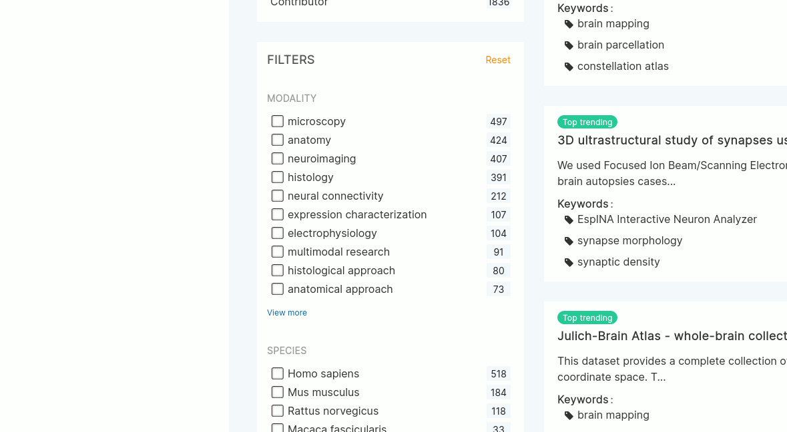

# Search with the UI

## Choose the search category
By default, the UI is set to search for datasets. You can find other result types you can search for in the
**Categories** section:   

*The categories selection showing an active selection of "Dataset"*

## Result view
The main section lists the results - even if you didn't search for anything yet.
In the default view, most resources (datasets, models, software, ...) are sorted by their date of publication
(latest ones at the top) with the exception of those that have some specific properties (e.g. the "trending"
instances which are the most visited entries in the last 30 days).

## Fulltext search
As you would expect from a search interface, you can do your search queries by simply typing in your search terms.
Once done, the result section will update and the numbers of results in the left panel
(**Categories** and the **Filters**) will update according to your results.

Please note, that depending on your search, the system will provide you with suggestions to prevent typos:

*Suggestions for alternative search terms: The system suggests to search for "amunts" for the search term "amounts"*

## Faceted search
In addition to the full text search, you can also use - depending on the search category you've selected - the faceted
search to narrow down the search results to the ones of interest to you.

*Faceted search mechanism*
